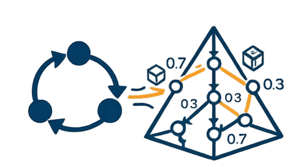

# Soar to PRISM Translator

<p align="center">
  
</p>

This project provides a tool for translating cognitive models written in the [Soar cognitive architecture](https://soar.eecs.umich.edu/) into equivalent models in the [PRISM model checker](https://www.prismmodelchecker.org/) formalism. The translation is designed to support formal verification of cognitive models using PRISM’s probabilistic model checking capabilities.

---

## Motivation

The purpose of this translator is to enable:
- Formal analysis of Soar agent behavior in safety-critical domains.
- Integration of cognitive architectures with model checking pipelines.
- Automated reasoning over decision-making policies using probabilistic semantics.

---

## Project Structure

```bash
SoarToPrismTranslator/
├── src/
│   └── main/
│       ├── antlr4/
│       │   └── edu/fit/assist/soar/
│       │       └── Soar.g4                # ANTLR4 grammar for parsing Soar rules
│       └── java/
│           └── edu/fit/assist/translator/
│               ├── soar/
│               │   ├── main.java          # Entry point for the translation tool
│               │   ├── Visitor.java       # Translation logic using ANTLR visitor pattern
│               │   ├── Translate.java     # General PRISM translator
│               │   ├── TimeBasedTranslator.java # Time-based model translator
│               │   └── ...
│               └── gen/                   # Generated ANTLR parsers
├── models/
│   ├── physiology/                        # Physiological models (e.g., sick.pm)
│   ├── attention/                         # Attention models
│   └── translated soar models/            # Manually translated PRISM models
├── CONFIG_GUIDE.md                        # Configuration file documentation
├── README.md
├── test_config.json                       # Example configuration file
└── pom.xml                                # Maven build file
```

---

## Requirements

- Java 17+
- [Apache Maven](https://maven.apache.org/) (for building the project)
- [ANTLR4](https://www.antlr.org/) (automatically managed by Maven)

---

## 🚀 Getting Started

### 1. Clone the Repository

```bash
git clone https://github.com/ParthGaneriwala/SoarToPrismTranslator.git
cd SoarToPrismTranslator
```

### 2. Build the Project

The ANTLR4 parser is automatically generated during the Maven build:

```bash
mvn clean compile
```

### 3. Run the Translator

**Important:** Currently, only time-based models (models with time-related variables like `time-counter` or `total-time`) are supported. The general translator for non-time-based models is not functional at this time.

You can run the translator with or without a configuration file:

**Without configuration (uses inference from Soar rules):**
```bash
mvn exec:java -Dexec.mainClass="edu.fit.assist.translator.soar.main" \
  -Dexec.args="path/to/your/model.soar"
```

**With configuration file (for probability distributions and model parameters):**
```bash
mvn exec:java -Dexec.mainClass="edu.fit.assist.translator.soar.main" \
  -Dexec.args="path/to/your/model.soar path/to/config.json"
```

The translated PRISM model will be:
- Printed to stdout
- Written to `output1.pm` in the project root

### 4. Configuration Support

For complex models requiring probability distributions, response time distributions, or error rates, you can provide an external configuration file. See [CONFIG_GUIDE.md](CONFIG_GUIDE.md) for detailed documentation on:
- Configuration file format (JSON)
- Model parameters
- Probability distributions
- Sickness probability tables
- Response and error distributions

---

## 🧪 Example

### Input (Soar):
```soar
sp {propose*initialize
   (state <s> ^superstate nil
             -^name)
-->
   (<s> ^operator <o> +)
   (<o> ^name initialize)
}

sp {apply*initialize
   (state <s> ^operator.name initialize)
-->
   (<s> ^name mission-monitor
        ^time-counter 0)
}
```

### Output (PRISM):
```prism
dtmc

module mission_monitor
  state : [0..1] init 0;
  time_counter : [0..100] init 0;
  
  [] state=0 -> (state'=1);
  [] state=1 & time_counter<100 -> (time_counter'=time_counter+1);
endmodule
```

---

## 🛠️ Features

- ✅ Supports production rule parsing (`sp` rules)
- ✅ Handles state-operator-goal structures
- ✅ Time-based model translation with time windows
- ✅ External configuration file support for probability distributions
- ✅ Automatic module extraction from Soar rule patterns
- ✅ Variable range inference and normalization
- ✅ Support for both DTMC and MDP model types
- ⚠️ General PRISM translation (non-time-based models) is currently not functional

---

## Architecture

- Uses **ANTLR4** to parse Soar models.
- Implements a **Visitor** or **Listener** pattern to walk the parse tree.
- Outputs equivalent **PRISM modules**, assuming a deterministic or DTMC structure.

### Translation Flow (Input → Parser → Refinement → Output)

1. **Input** – `main` loads the provided Soar file (and optional config) and stitches together all rules via `Input.getSoarRules(...)`.
2. **Parser** – ANTLR (`SoarLexer`/`SoarParser`) builds a parse tree that `Visitor` walks to populate `SoarRules`.
3. **Refinement** – The translator inspects the collected rules to determine if it's a time-based model (by checking for time-related variables like `time-counter` or `total-time`). Currently, only the time-based path (`TimeBasedTranslator.translateToTimeBased`) is functional. The general path (`Translate.translateSoarToPrismGeneral`) is not working at this time.
4. **Output** – The time-based translator emits PRISM code, which `main` prints to stdout and writes to `output1.pm`.

---

## Limitations

- **The general translator is currently not functional** - only time-based models are supported.
- Time-based models must include time-related variables (e.g., `time-counter`, `total-time`) in their Soar rules.
- Does not yet support numeric preference comparisons or impasses.
- Translation assumes one-to-one rule-to-transition mapping.
- Currently supports only basic production rules and deterministic transitions.

---

## 🔗 References

- [Soar Cognitive Architecture](https://soar.eecs.umich.edu/)
- [PRISM Model Checker](https://www.prismmodelchecker.org/)
- [ANTLR4 Documentation](https://github.com/antlr/antlr4)
